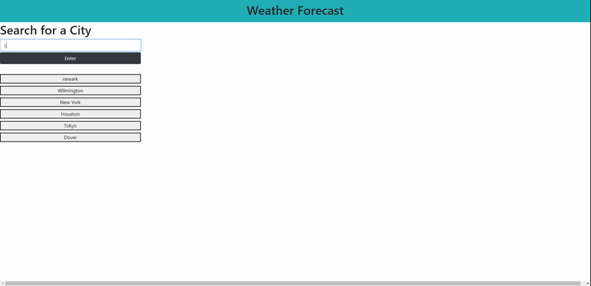

# weather-dashboard-server-side-api

## Summary
 The Weather Dashboard gives the user weather information about the city that the user is searching for. This Dashboard also saves the the previous city inputted by the user for more convenient use.

## Technology Used
 - HTML : Use to stucture our website
 - CSS : Bootstrap to make the styling of the page
 - JS  : Web api like and moment.js was used to keep track of time and to traverse the the HTML. Also just server-side api OpenWeatherMap to get data for a city's weather.
 - Git : for version control system to track changes to source code
 - GitHub : hosts the repository that can be deployed to GitHub Pages
 - BootStrap: for more convenient styling
 - OpenWeatherMap Api - for 5-day forecast data on different cities
 - Moment.js - To convert unix time to readable dates

## Site Picture


## Deployed Link
https://chanjeff520.github.io/weather-dashboard-server-side-api/

## Instructions
<ol>
<li>Start by entering a city in the city search box</li>
<li>Click "Enter" to show the city on the left. If the city does not exist, then the left side will show nothing.</li>
<li>Click on the city on the left for quick access to city that has been searched before.</li>
</ol>


## Code Snippet
```js

//OpenWeatherMap API call
function getApi(cityinfo){
    //asked for imperial Units instead of calvins. Also using the 5-day forecast
    var weatherApiLink =    "https://api.openweathermap.org/data/2.5/forecast?q=" + cityinfo +
                            "&units=imperial&appid=580736b4e81d6ca498d989b1ea6ba5b1";

    //The fetch call calls the api by the link that is stored inside
    //  the variable weatherApiLink
    fetch(weatherApiLink)
    //checks if the response is valid, anything 400 or above will return a not ok
    .then(function(response){
        if(response.ok){
            return response.json();
        }else{
            alert("Please input a valid city.")
            return;
        }
    })
    //the data is the search parameters that we gave the api
    .then(function(data){
        //clears the display that is on the screen
        clearDisplay();
        //renders the display given the data needed
        renderWeather(data);
    })
}

```
This function makes API calls depending on the city pass to it. 

## Author Links
- [LinkedIn](https://www.linkedin.com/in/jefflchan/)
- [GitHub](https://github.com/chanjeff520)
